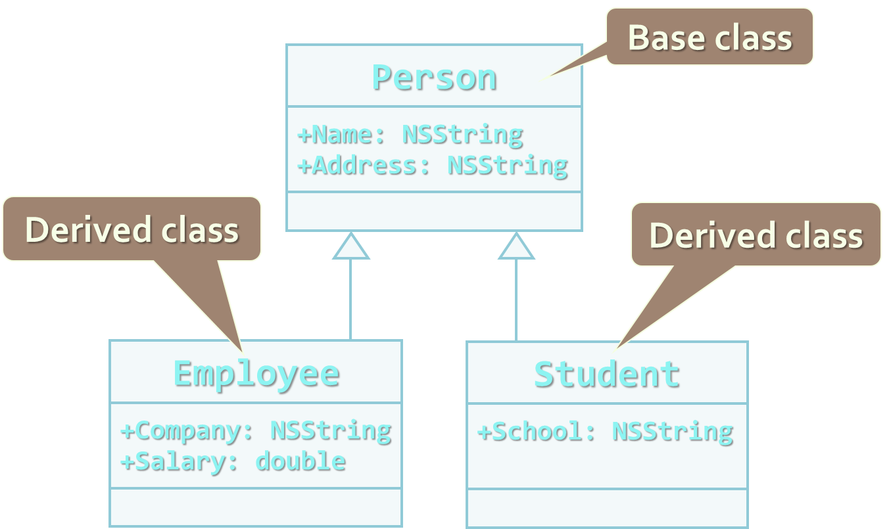
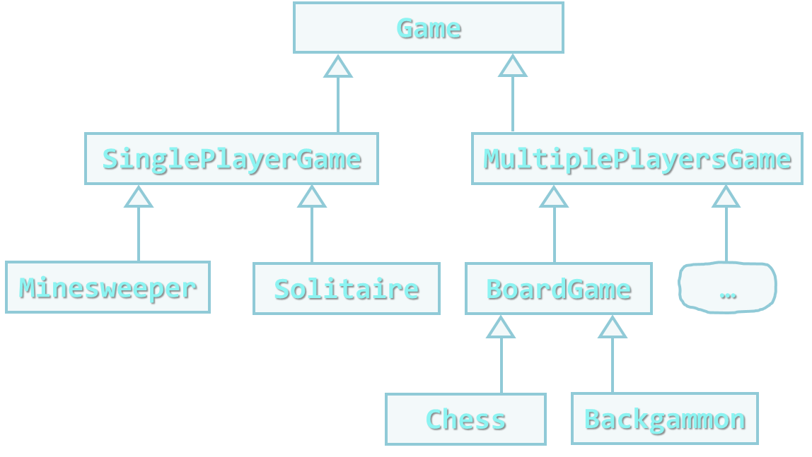
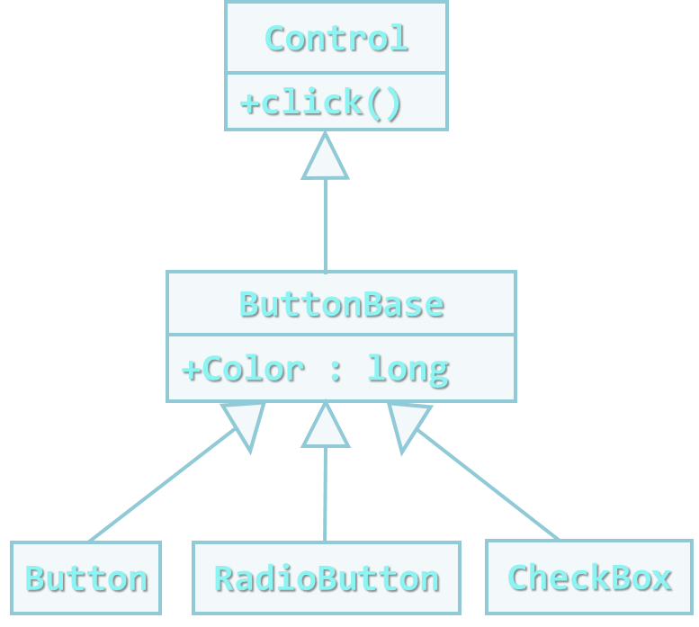

<!-- section start -->
<!-- attr: { class:'slide-title', showInPresentation:true, hasScriptWrapper:true, style:'' } -->
# Objects and Classes

<div class="signature">
    <p class="signature-course">Learning & Development</p>
    <p class="signature-initiative">http://academy.telerik.com</p>
    <a href = "Mobile apps for iPhone & iPad" class="signature-link">Mobile apps for iPhone & iPad</a>
</div>

<!-- attr: { showInPresentation:true, style:'' } -->
# Table of Contents
- Classes and Objects
  - What are Objects?
  - What are Classes?
  - Object Pointers
- Classes in Objective-C
  - Declaring Class
  - Properties and methods
  - Init methods
- Dynamic Binding

<!-- attr: { showInPresentation:true, style:'' } -->
# Table of Contents
- OOP Principles
- Inheritance
- Protocols
- Abstraction
- Encapsulation

<!-- section start -->
<!-- attr: { class:'slide-section', showInPresentation:true, style:'' } -->
# Classes and Objects
##  Modeling Real-world Entities with Objects

<!-- attr: { showInPresentation:true, style:'' } -->
# What are Objects?
- Software objects model real-world objects or abstract concepts
  - Examples:
    - bank, account, customer, dog, bicycle, queue
- Real-world objects have `states` and `behaviors`
  - Account' states:
    - holder, balance, type
  - Account' behaviors:
    - withdraw, deposit, suspend

<!-- attr: { showInPresentation:true, hasScriptWrapper:true, style:'' } -->
# What are Objects? (2)
- How do software objects implement real-world objects?
  - Use variables/data to implement states
  - Use methods/functions to implement behaviors
- An object is a software bundle of variables and related methods


<!-- attr: { showInPresentation:true, style:'' } -->
# Objects Represent
- Things from the real world
    - `✓` checks
    - `✓` people
    - `✓` shopping list
- Things from the computer world
    - `✓` numbers
    - `✓` characters
    - `✓` queues
    - `✓` arrays


<!-- attr: { showInPresentation:true, style:'' } -->
# What is a Class?
- The formal definition of `class`:

`Classes` act as templates from which an instance of an object is created at run time. Classes define the properties of the object and the methods used to control the object's behavior.

    - Definition by Google

<!-- attr: { showInPresentation:true, style:'' } -->
# Classes
- Classes provide the structure for objects
  - Define their prototype, act as template
- Classes define:
  - Set of `attributes`
    - Represented by variables and properties
    - Hold their `state`
  - Set of actions (`behavior`)
    - Represented by methods
- A class defines the methods and types of data associated with an object

<!-- attr: { showInPresentation:true, hasScriptWrapper:true, style:'' } -->
# Classes – Example

```objective-c
Account
```

```objective-c
+owner: Person
+ammount: double
```

```objective-c
+suspend
+deposit: (double) sum
+withdraw: (double) sum
```
<div class="fragment balloon" style="width:250px; top:15%; left:40%">Class Name</div>
<div class="fragment balloon" style="width:250px; top:25%; left:40%">Attributes(Properties and Fields)</div>
<div class="fragment balloon" style="width:250px; top:40%; left:40%">Operations(Methods)</div>

<!-- attr: { showInPresentation:true, style:'' } -->
# Objects
- An `object` is a concrete `instance` of a particular class
- Creating an object from a class is called `instantiation`
- Objects have state
  - Set of values associated to their attributes
- Example:
  - Class: Account
  - Objects: Ivan's account, Peter's account

<!-- attr: { showInPresentation:true, hasScriptWrapper:true, style:'' } -->
# Objects – Example
- Class

```objectivec
Account
```

```objectivec
+owner: Person
+ammount: double
```

```objectivec
+suspend
+deposit: (double) sum
+withdraw: (double) sum
```

<!-- attr: { showInPresentation:true, hasScriptWrapper:true, style:'' } -->
# Objects – Example
- Object

```objectivec
clarkAccount
```

```objectivec
+Owner="Clark Kent"
+Ammount=200.0
```

<!-- attr: { showInPresentation:true, hasScriptWrapper:true, style:'' } -->
# Objects – Example
- Object

```objectivec
bruceAccount
```

```objectivec
+Owner="Bruce Wayne"
+Ammount=100000000.0
```

<!-- attr: { showInPresentation:true, hasScriptWrapper:true, style:'' } -->
# Objects – Example
- Object

```objectivec
tonyAccount
```

```objectivec
+Owner="Tony Stark"
+Ammount=100000000.9
```

<!-- section start -->
<!-- attr: { class:'slide-section', showInPresentation:true, style:'' } -->
# Object Types and  App Memory

<!-- attr: { showInPresentation:true, style:'' } -->
# App Memory
- Every MAC OS X/iOS application has two places to hold the values of the app (variables and stuff)
  - The Stack and the Heap
- The stack is a fixed-sized stack data structure that holds primitive types and object pointers
  - Only the address, not the object itself
- The heap is the place where all objects live
  - Their addresses are stored on the stack

<!-- attr: { showInPresentation:true, style:'' } -->
# Primitive Object Types
- Some objects in Obj-C are passed by value
  - They live on the stack and are destroyed when out of scope
  - Their value is `copied` when passed as a parameter to a method, or when assigned to another object
  - NSInteger, NSUInteger, CGFloat, etc…
  - char, int, float, double, etc…

<!-- attr: { showInPresentation:true, style:'' } -->
# Reference Object Types
- Other objects are passed by reference
  - They live in the Heap, and only their address in the Heap is passed
    - Not copied, only their addresses (references)
  - NSObject, NSArray, NSString, etc…
  - Instances of custom classes are also stored on the heap

<!-- attr: { class:'slide-section demo', showInPresentation:true, style:'' } -->
<!-- # Primitive and Reference Types -->
##  [Demo]()

<!-- section start -->
<!-- attr: { class:'slide-section', showInPresentation:true, hasScriptWrapper:true, style:'' } -->
# Classes in Objective-C
## Using Classes and their Class Members


<!-- attr: { showInPresentation:true, hasScriptWrapper:true, style:'' } -->
# Classes in Objective-C
- Classes – basic units that compose programs
- Implementation is `encapsulated` (hidden)
- Classes in Objective-C can contain:
  - Fields (member variables)
  - Properties
  - Methods
- Every class in Objective-C has two files
  - Public interface file (the .h file)
  - Implementation file (the .m file)


<!-- attr: { showInPresentation:true, style:'' } -->
# Fields
- `Fields` are data members of a class
  - Can be variables and constants (read-only)
  - All fields are private (they can be accessed only from the implementation of the class)
- Accessing a field doesn’t invoke any actions of the object
  - Just accesses its value
- Most of the cases they are hidden from the world
  - They live only in the implementation part

<!-- attr: { showInPresentation:true, style:'' } -->
# Accessing Fields
- `Constant fields `can be only read
- `Variable fields `can be read and modified
- Usually properties are used instead of directly accessing variable fields

<!-- attr: { showInPresentation:true, style:'' } -->
# Creating Classes in Objective-C
- Classes in Objective-C consists of two separate files - ClassName.h and ClassName.m
  - ClassName.h contains the public interface of the class
    - Members that are accessible from other objects
  - ClassName.m contains the implementations of the public interface and private members

<!-- attr: { class:'slide-section demo', showInPresentation:true, style:'' } -->
<!-- # Creating Classes -->
##  [Demo]()

<!-- attr: { showInPresentation:true, style:'' } -->
# Properties
- `Properties` look like fields
  - Have name and type
  - Can contain code, executed when accessed
  - Declared using the `@property` directive

<!-- attr: { showInPresentation:true, style:'' } -->
# Properties
- Usually used for `encapsulation`
  - They control the access to the data fields
  - They validate the given input values
  - Can contain more complex logic
    - Like parsing or converting data

<!-- attr: { showInPresentation:true, style:'' } -->
# Properties
- Every property has two components called `accessors`
  - `Getter`
    - Called when the property is requested

```objective-c
double x = shape.x;
```
  - `Setter`
    - Called when the property value is changing

```objective-c
shape.x = 4.5;
```

<!-- attr: { showInPresentation:true, hasScriptWrapper:true, style:'' } -->
# Properties (2)
- Properties can be either:
  - Read-only
  - Write-only
  - Read-write
  - By default they are read-write

```objective-c
@interface
@property (readonly) int size;
@property int capacity;
@end
```

<!-- attr: { class:'slide-section demo', showInPresentation:true, style:'' } -->
<!-- # Properties -->
##  [Demo]()

<!-- attr: { showInPresentation:true, style:'' } -->
# Properties:Getters and Setters
- Properties provide a getter and a setter methods
  - Used to execute some code when assigning a value or getting the value of the property
  - By default:
    - The `setter` method is called `setPropertyName`
    - The `getter `method is with `the name of the property`

```objective-c
@property int capacity;
-(int) capacity{ … }
-(void) setCapacity { … }
```

<!-- section start -->
<!-- attr: { class:'slide-section', showInPresentation:true, style:'' } -->
# Properties:Getters and Setters
##  Live demo

<!-- section start -->
<!-- attr: { class:'slide-section', showInPresentation:true, style:'' } -->
# Instantiating Objects

<!-- attr: { showInPresentation:true, style:'' } -->
# Instantiating Objects
- Objective-C provides `two ways of instantiating objects`
  - Using `init` methods
  - Using `factory` methods

```objective-c
Person xp = [[Person alloc] init];
```

```objective-c
Person xp = [Person person];
```

```objective-c
Person xp = [[Person alloc] initWithFirstname: @"Peter"];
```

```objective-c
Person xp = [Person personWithFirstname: @"Peter"];
```

<!-- attr: { showInPresentation:true, style:'' } -->
# Instantiating Objects
- Objective-C provides `two ways of instantiating objects`
  - Using `init` methods
  - Using `factory` methods

```objective-c
Person xp = [[Person alloc] init];
```

```objective-c
Person xp = [Person person];
```

```objective-c
Person xp = [[Person alloc] initWithFirstname: @"Peter"];
```

```objective-c
Person xp = [Person personWithFirstname: @"Peter"];
```
- Both are equally used and in best case both should be present

<!-- section start -->
<!-- attr: { class:'slide-section', showInPresentation:true, style:'' } -->
# Init Methods

<!-- attr: { showInPresentation:true, style:'' } -->
# Init Methods
- Init methods are used to create objects
  - They are regular methods that have a special meaning in modern MAC/iOS apps
    - ARC checks for methods with prefix "init" and treat their result differently

<!-- attr: { showInPresentation:true, style:'' } -->
# Init Methods Template
- Init methods have a special template to follow:

```objective-c
-(id) init
{
  self = [super init];
  if (self)
  {
    //the parent is instantiated properly and can   
    //continue instance specific stuff..
  }
  return self;
}
```

<!-- attr: { showInPresentation:true, style:'' } -->
# Multiple Init Methods
- ARC checks for methods with prefix "init"
  - All of the following are valid init methods:

```objectivec
@interface Person: NSObject
@ends
```

<!-- attr: { showInPresentation:true, style:'' } -->
# Multiple Init Methods
- ARC checks for methods with prefix "init"
  - All of the following are valid init methods:

```objectivec
@interface Person: NSObject
@ends
```

```objectivec
-(id) init;
```
- The default init method
- Produces objects without parameters

<!-- attr: { showInPresentation:true, style:'' } -->
# Multiple Init Methods
- ARC checks for methods with prefix "init"
  - All of the following are valid init methods:

```objectivec
@interface Person: NSObject
@ends
```

```objectivec
-(id) init;
```

```objectivec
-(id) initWithFullname: (NSString x) fullname;
```
- init method that takes a single parameter
- Handles the role of "method overloading"

<!-- attr: { showInPresentation:true, style:'' } -->
# Multiple Init Methods
- ARC checks for methods with prefix "init"
  - All of the following are valid init methods:

```objectivec
@interface Person: NSObject
@ends
```

```objectivec
-(id) init;
```

```objectivec
-(id) initWithFullname: (NSString x) fullname;
```

```objectivec
-(id) initWithFirstname: (NSString x) fname
            andLastName: (NSString x) lname;
```
- init method that takes two parameters
- The same as the others

<!-- attr: { class:'slide-section demo', showInPresentation:true, style:'' } -->
<!-- # Multiple Init Methods -->
##  [Demo]()

<!-- section start -->
<!-- attr: { class:'slide-section', showInPresentation:true, style:'' } -->
# Factory Methods

<!-- attr: { showInPresentation:true, style:'' } -->
# Factory Methods
- Factory methods are no more than hidden init methods
  - They are class methods (the message is sent to the class, instead of to a concrete object)

<!-- attr: { showInPresentation:true, style:'' } -->
# Factory Methods (2)
- By concept, factory methods' identifiers start with the name of the class, i.e.

```objectivec
@interface Person: NSObject
+(id) person;
+(id) personWithFirstname: (NSString x) fname;
@end
```

```objectivec
@implementation
+(id) personWithFirstname: (NSString x) fname
{
  Person xp = [[Person alloc] init];
  p.firstname = fname;
  return p;
}
@end
```

<!-- attr: { class:'slide-section demo', showInPresentation:true, style:'' } -->
<!-- # Factory Meth0ds -->
##  [Demo]()

<!-- section start -->
<!-- attr: { class:'slide-section', showInPresentation:true, hasScriptWrapper:true, style:'' } -->
# Fundamental Principles of OOP
## Object-Oriented

<!-- attr: { showInPresentation:true, style:'' } -->
# Fundamental Principles of OOP
- Inheritance
  - Inherit members from parent class
- Abstraction
  - Define and execute abstract actions
- Encapsulation
  - Hide the internals of a class
- Polymorphism
    - Access a class through its parent interface

<!-- attr: { showInPresentation:true, hasScriptWrapper:true, style:'' } -->
- Inheritance


<!-- attr: { showInPresentation:true, style:'font-size: 36px' } -->
# Classes and Protocols
- Classes define attributes and behavior
  - Fields, properties, methods, etc.
  - Methods contain code for execution

  ```objectivec
  @interface Shape: NSObject
  @end
  ```

  ```objectivec
  @protocol Figure
  @end
  ```

- Protocols define a set of operations
  - Empty methods and properties, left to be implemented later


```objectivec
@implementation Shape
@end
```

<!-- attr: { showInPresentation:true, style:'' } -->
# Inheritance
- Inheritance allows classes to inherit characteristics from an existing parent (super) class
  - Attributes (fields and properties)
  - Operations (methods)
- A child class can extend the parent class
  - Add new fields and methods
  - Redefine methods (modify existing behavior)
- A class can conform to a protocol by providing implementation for its methods

<!-- attr: { showInPresentation:true, style:'' } -->
# Types of Inheritance
- Inheritance terminology
- `derived class` inherits `base/parent class`
- `class` conforms to `protocol`

<!-- attr: { showInPresentation:true, hasScriptWrapper:true, style:'' } -->
# Inheritance – Benefits
- Inheritance has a lot of benefits
  - Extensibility
  - Reusability (code reuse)
  - Provides abstraction
  - Eliminates redundant code
- Use inheritance for buidling is-a relationships
  - E.g. person is-a mammal
- Don't use it to build has-a relationship
  - E.g. person has-a name


<!-- attr: { showInPresentation:true, style:'' } -->
# Inheritance
- Child classes implicitly gain all members from the super class
  - All fields, methods, properties
  - Some members are inaccessible (hidden)
- The class whose methods are inherited is called base (parent) class
- The class that gains new functionality is called derived (child) class

<!-- attr: { showInPresentation:true, hasScriptWrapper:true, style:'font-size: 30px' } -->
# Inheritance – Example




<!-- attr: { showInPresentation:true,hasScriptWrapper:true, style:'' } -->
# Class Hierarchies
- Inheritance leads to a hierarchies of classes and / or protocols in an application:



<!-- attr: { showInPresentation:true, style:'' } -->
# Inheritance in Objective-C
- A class can inherit only one base class
  - E.g. NSMutableArray derives from NSArray
- A class can conform to several protocols
  - This is Obj-C’s form of multiple inheritance
  - Shape conforms to Movable and Drawable

<!-- attr: { showInPresentation:true, hasScriptWrapper:true, style:'' } -->
# How to Define Inheritance?
- Specify the name of the base class after the name of the derived (with colon)

```objectivec
@interface Person: NSObject
@property (strong, nonatomic) NSStringx firstname;
@property (strong, nonatomic) NSStringx lastname;
@end
```

```objectivec
@interface Ninja: Person
@property int rank;
@end
```
<div class="fragment balloon" style="width:250px; top:60%; left:40%">Inherits properties firstname and lastname from Person</div>


<!-- attr: { showInPresentation:true, hasScriptWrapper:true, style:'' } -->
# How to Define Inheritance?
- Specify the name of the base class after the name of the derived (with colon)

```objectivec
@interface Person: NSObject
@property (strong, nonatomic) NSStringx firstname;
@property (strong, nonatomic) NSStringx lastname;
@end
```

```objectivec
@interface Ninja: Person
@property int rank;
@end
```
<div class="fragment balloon" style="width:250px; top:60%; left:40%">Inherits properties firstname and lastname from Person</div>
<div class="fragment balloon" style="width:250px; top:80%; left:40%">Adds new property</div>


<!-- attr: { showInPresentation:true, style:'' } -->
# Simple Inheritance Example

```objectivec
@interface Person: NSObject
-(instancetype) initWithFirstname: (NSString x) fname
                      andLastname: (NSString x) lname;
-(void) introduce;
-(void) walk;
@end
```

```objectivec
@implementation Person
@synthesize firstname; @synthesize lastname;
-(instancetype) initWithFirstname: (NSString x) fname
                      andLastname: (NSString x) lname{
}
-(void) introduce{
}
-(void) walk{
}
@end
```

<!-- attr: { showInPresentation:true, style:'font-size: 38px' } -->
# Simple Inheritance Example

```objectivec
@interface Ninja: Person
@property int rank;
-(instancetype) initWithRank: (int) rank;
-(void) fight;
@end
```

```objectivec
@implementation Ninja
@synthesize rank;
-(instancetype) initWithRank: (int) rank{
  self = [super initWithFirstname: @"[Unknown]"
                      andLastname: @"[Unknown]"];
  self.rank = rank;
  return self;
}
-(void) walk{
}
-(void) fight{

}
@end
```

<!-- attr: { showInPresentation:true, hasScriptWrapper:true, style:'font-size: 38px' } -->
# Simple Inheritance Example

```objectivec
@interface Ninja: Person
@property int rank;
-(instancetype) initWithRank: (int) rank;
-(void) fight;
@end
```

```objectivec
@implementation Ninja
@synthesize rank;
-(instancetype) initWithRank: (int) rank{
  self = [super initWithFirstname: @"[Unknown]"
                      andLastname: @"[Unknown]"];
  self.rank = rank;
  return self;
}
-(void) walk{
}
-(void) fight{

}
@end
```
<div class="fragment balloon" style="width:250px; top:15%; left:65%">Adds new property – rank</div>
<div class="fragment balloon" style="width:250px; top:30%; left:65%">Adds new method – fight</div>
<div class="fragment balloon" style="width:250px; top:65%; left:30%">Overwrites the method from the parent</div>

<!-- attr: { class:'slide-section demo', showInPresentation:true, hasScriptWrapper:true, style:'' } -->
<!-- # Simple Inheritance  -->
##  [Demo]()


<!-- attr: { showInPresentation:true, style:'' } -->
# Inheritance: Important Aspects
- In Objective-C there is no multiple inheritance
  - Yet, a class can conform to multiple protocols
- Class members are also inherited
- Init methods are inherited
- Inheritance is transitive relation
  - If C is derived from B, and B is derived from A, then C inherits A as well

<!-- attr: { showInPresentation:true, style:'' } -->
# Inheritance: Important Features
- When a derived class extends its base class
  - It can freely add new members
  - Cannot remove derived ones
- Declaring new members with the same name or signature overwrites the inherited ones
- A class may not provide implementation to some methods
  - Derived classes can provide the implementation

<!-- section start -->
<!-- attr: { class:'slide-section', showInPresentation:true, hasScriptWrapper:true, style:'' } -->
# Abstraction


<!-- attr: { showInPresentation:true, hasScriptWrapper:true, style:'' } -->
# Abstraction
- Abstraction means ignoring irrelevant features, properties, or functions and emphasizing the relevant ones ...
- ... relevant to the given project

```
"Relevant" to what?
```

  - With an eye to future reuse in similar projects
- Abstraction helps managing complexity

<!-- attr: { showInPresentation:true, style:'' } -->
# Abstraction (2)
- Abstraction is something we do every day
  - Looking at an object, we see those things about it that have meaning to us
  - We abstract the properties of the object, and keep only what we need
  - E.g. students get "name" but not "color of eyes"
- Allows us to represent a complex reality in terms of a simplified model
- Abstraction highlights the properties of an entity that we need and hides the others

<!-- attr: { showInPresentation:true, hasScriptWrapper:true, style:'' } -->
# Abstraction in .NET
- In Objective-C object-oriented programming abstraction is achieved in several ways:
  - Protocols
  - Inheritance



<!-- attr: { showInPresentation:true, style:'' } -->
# Protocols
- An protocol defines a set of messages (methods) that given object should perform
  - Also called "contract" for providing a set of operations
  - Defines abstract behavior
- Protocols provide abstractions
  - You invoke the abstract actions
  - Without worrying how it is internally implemented

<!-- attr: { showInPresentation:true, style:'' } -->
# Protocols(2)
- Protocols describe a prototype of group of methods (operations) or properties
  - Can be conformed by a given class
  - Define only the prototypes of the operations
    - No concrete implementation is provided
  - Can be used to define abstract data types
  - Can not be instantiated
  - Can contain optional and required members

<!-- attr: { showInPresentation:true, style:'' } -->
# Protocols – Example

```objectivec
@protocol Shape
@property double x;
@property double y;
-(void) moveToX:(double) x andY: (double) y;
-(double) calculateSurface;
-(double) calculateArea;
@end
@protocol Resizable
@property double width;
@property double height
-(void) resizeWidth: (double) width;
-(void) resizeHeight: (double) height;
-(void) resizeWidth: (double) width
          andHeight: (double) weighty;
@end
```

<!-- attr: { showInPresentation:true, style:'' } -->
# Protocols Implementation
- Classes can conform to one or several protocols

```objectivec
@interface Rectangle : NSObject<Shape>
-(instancetype) initWithX: (double) x
		           y: (double) y
                    width: (double) width
                andHeight: (double) height;
@end;
```
- Implementer classes must conform all methods and properties of the protocol

<!-- attr: { showInPresentation:true, style:'' } -->
# Interface Implementation (2)

```objectivec
@interface Rectangle: NSObjet<Shape, Resizable>
// Rectangle specific declarations
@end
```

```objectivec
@implementation Rectangle
@synthesize x; @synthesize y;
@synthesize width; @synthesize height;
-(void) moveToX:(double) x
           andY: (double) y { /x implementation x/ }
-(double) calculateSurface { /x implementation x/ }
-(double) calculateArea { /x implementation x/ }
-(void) resizeWidth: (int) width { /x implementation x/ }
-(void) resizeHeight: (int) height { /x implementation x/ }
-(void) resizeWidth: (int) width
          andHeight: (int) weighty { /x implementation x/ }
@end
```

<!-- attr: { class:'slide-section demo', showInPresentation:true, hasScriptWrapper:true, style:'' } -->
<!-- # Protocols andImplementations -->
##  [Demo]()


<!-- section start -->
<!-- attr: { class:'slide-section', showInPresentation:true, hasScriptWrapper:true, style:'' } -->
# Encapsulation

<!-- attr: { showInPresentation:true, style:'' } -->
# Encapsulation
- Encapsulation hides the implementation details
- Class announces some operations (methods) available for its clients – its public interface
- All data members (fields) of a class should be hidden
  - Accessed via properties (read-only and read-write)
- No interface members should be hidden

<!-- attr: { showInPresentation:true, style:'' } -->
# Encapsulation – Example
- Data fields are private
- Init methods and accessors are defined (getters and setters)

```objectivec
Person
```

```objectivec
-_name : NSString
-_age : int
```

```objectivec
+initWith: (NSStringx) name    
   andAge: (int) age
+name : NString
+age : int
```

<!-- attr: { showInPresentation:true, style:'' } -->
# Encapsulation in .NET
- Fields are always declared private
  - They cannot be public anyway
- Init methods are almost always declared public
- Protocol members are always public
- Non-interface members are declared private / protected

<!-- attr: { showInPresentation:true, style:'' } -->
# Encapsulation – Benefits
- Ensures that structural changes remain local:
  - Changing the class internals does not affect any code outside of the class
  - Changing methods' implementation does not reflect the clients using them
- Encapsulation allows adding some logic when accessing client's data
  - E.g. validation on modifying a property value
- Hiding implementation details reduces complexity &rarr; easier maintenance

<!-- section start -->
<!-- attr: { class:'slide-section', showInPresentation:true, hasScriptWrapper:true, style:'' } -->
# Encapsulation
## Live Demo

  <!-- attr: { class:'slide-section', showInPresentation: true } -->
  <!-- # Questions
  ##  OOP in Objective-C -->
